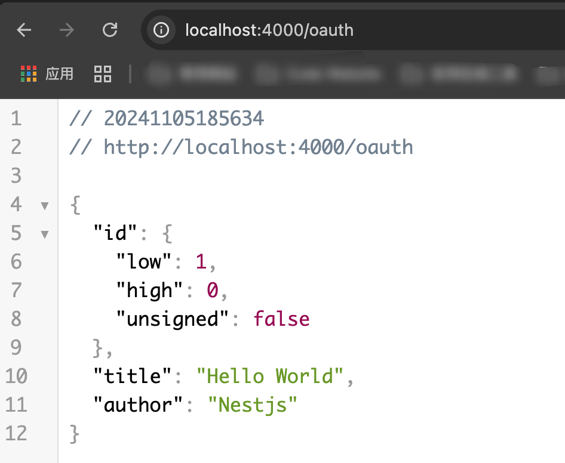

# grpc 构建微服务实战

> 这是一个使用gRPC构建的微服务实战构建参考。

## 项目结构
```bash
- apps # 微服务应用，gateway是主要的网关应用，也是主要的调用者，其它应用都是微服务
- docker # docker 镜像打包的配置文件
- proto # gRPC的proto文件
- libs # 通用库 采用nestjs 官方提供的library
- types # 定义的类型文件
- commitlint.config.js # git commit 规范配置文件
- grpc-cli.ts # grpc-cli 配置文件，用于将.proto定义的gRPC的数据结构转为typescript
- tsconfig.json # ts配置文件
- nest-cli.json # nest配置文件
```

## 使用yaml作为配置文件

> 本项目使用yaml作为配置文件，使用yaml作为配置文件的好处是，配置文件可以很方便的被编辑器解析，方便查看和编辑。

由于nestjs本身不支持多部署环境，我使用了[cross-env](https://www.npmjs.com/package/cross-env)来设置环境变量，这样就可以在启动应用的时候，指定环境变量，从而使用不同的配置文件。

当前开发环境使用的是dev，生产环境使用的是prod。因此，**yaml配置文件需要有两份：application.dev.yaml，application.prod.yaml**。

由于作者这两份文件中有敏感信息，不会提交到git仓库，需要根据application.yaml文件自行改造

如有疑问，请联系我，我将进一步修改本文档。

## 命令
```bash
pnpm run start:gateway # 启动网关应用，如果更改了文件，需要重新运行
pnpm run start:gateway:dev # 启动网关应用，如果更改了文件，会自动重新编译
pnpm run start:oauth # 启动oauth服务
pnpm run start:oauth:dev # 启动oauth服务，如果更改了文件，会自动重新编译
pnpm run start:all # 启动所有服务(网关和所有的微服务)
pnpm run start:all:dev # 启动所有服务(网关和所有的微服务)，如果更改了文件，会自动重新编译

pnpm run copy-proto # 将proto文件拷贝到dist/proto目录下
pnpm run gen-proto-ts # 将proto文件生成为typescript文件(libs/interface/src)
```

## 效果

如果一切正常，启动应用之后，可以通过浏览器访问http://localhost:4000


如果oauth服务正常，你可以通过[浏览器访问](http://localhost:4000/oauth)看到



## docker 集成部署

你可以通过查看本地的[docker-compose.yaml](./docker-compose.yaml)文件，了解如何使用docker 集成部署。
并了解我如何使用多个节点部署微服务以保证高可用性。

```bash
docker-compose up -d # 部署
docker-compose down # 解除部署，但不会清除已经构建的镜像文件
docker-compose up -d --build # 部署并重新构建镜像
```

## 自定义本地构建命令
为了进一步方便docker中构建，我自定义了本地构建命令，你可以通过以下命令打包
```bash
single-build -n <app-name> # 仅构建一个应用
build-all-app # 构建所有应用
generate-package-json # 生成docker 中最终产物package.json文件，清除无关的命令选项，并只下载生产环境的依赖
```

## 更多
- [gRPC 官方文档](https://grpc.io/docs/languages/node/basics/)
- [nestjs官方文档](https://docs.nestjs.com/)

这里折腾了好久，bug还有很多，如果你碰到了问题，请提出issue，或者加群以获取更多支持。

## License
[MIT](LICENSE)

## 关于我
我是程序员零塔，全栈开发爱好者。
你可以访问我的 [网站](https://www.zerotower.cn)，
也可以加入QQ群[434063310]


